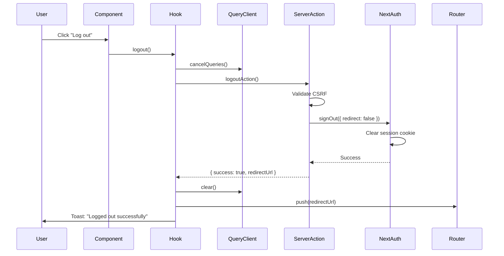

# Logout Feature Documentation

## Overview

This directory contains the complete logout implementation for the Next.js 16 application using NextAuth 5.0. The implementation follows the application's established patterns for server actions, type safety, and client-state management.

## Architecture

### File Structure

```
src/features/auth/logout/
├── logout.action.ts      # Server action for logout
├── use-logout.ts         # Custom React hook with TanStack Query
├── index.ts              # Public exports
└── README.md             # This file
```

## Implementation Details

### 1. Server Action (`logout.action.ts`)

**Purpose**: Handle server-side logout logic with NextAuth 5.0

**Features**:
- CSRF protection using the app's `handleAuthCsrf` utility
- NextAuth session cleanup via `signOut()`
- Comprehensive logging for audit trails
- Type-safe error handling
- Returns discriminated union result type

**Flow**:
1. Validates CSRF token to prevent cross-site attacks
2. Calls NextAuth `signOut({ redirect: false })` to clear session
3. Returns success with redirect URL or error message

**Security Considerations**:
- CSRF validation ensures request originates from same domain
- Server-side session invalidation prevents session reuse
- HTTP-only session cookie is cleared by NextAuth
- Logging helps detect suspicious logout patterns

### 2. Custom Hook (`use-logout.ts`)

**Purpose**: Client-side logout orchestration with cache management

**Features**:
- TanStack Query mutation for logout action
- Complete cache invalidation (prevents stale data)
- Client-side redirect after successful logout
- Toast notifications for user feedback
- Loading state management via `isPending`
- Graceful error handling

**Flow**:
1. `onMutate`: Cancel all in-flight queries and clear cache optimistically
2. Call server action to invalidate session
3. `onSuccess`: Clear all TanStack Query cache, show success toast, redirect
4. `onError`: Clear cache anyway (failsafe), show error toast

**Cache Strategy**:
- `queryClient.cancelQueries()`: Prevents race conditions
- `queryClient.clear()`: Removes all cached data
- Ensures no user data persists after logout

### 3. Type Definitions

**Location**: `src/features/auth/shared/types/action.types.ts`

```typescript
export type LogoutActionResult =
  | {
      success: true;
      redirectUrl: string;
    }
  | {
      success: false;
      error: string;
    };
```

**Benefits**:
- Type-safe discriminated union
- Compile-time guarantees for success/error handling
- Consistent with other action result types in the app

## Integration

### UI Component Integration

**Location**: `src/components/layout/dashboard/sidebar/user.tsx`

**Implementation**:
```tsx
const { mutate: logout, isPending: isLoggingOut } = useLogout();

const handleLogout = () => {
  logout();
};

<DropdownMenuItem
  onClick={handleLogout}
  disabled={isLoggingOut}
  className="cursor-pointer"
>
  {isLoggingOut ? (
    <Loader2 className="animate-spin" />
  ) : (
    <LogOut />
  )}
  {isLoggingOut ? "Logging out..." : "Log out"}
</DropdownMenuItem>
```

**Features**:
- Loading state with spinner animation
- Disabled state during logout
- Accessible button semantics
- Visual feedback (icon swap)

## Complete Logout Flow



## What Gets Cleaned Up

### Server-Side
- NextAuth session token (HTTP-only cookie: `next-auth.session-token`)
- JWT token invalidation
- Server-side session state

### Client-Side
- All TanStack Query cache entries
- In-flight query requests (cancelled)
- Component state (unmounted on redirect)
- Browser location (redirected to login)

### What Persists
- LocalStorage (if any app-specific data was stored)
- Browser history
- Service workers (if implemented)

**Note**: If your app uses localStorage, sessionStorage, or IndexedDB for user-specific data, you should extend the `useLogout` hook to clear those as well.

## Usage Examples

### Basic Usage
```tsx
import { useLogout } from "@/features/auth/logout";

function MyComponent() {
  const { mutate: logout, isPending } = useLogout();

  return (
    <button onClick={() => logout()} disabled={isPending}>
      {isPending ? "Logging out..." : "Log out"}
    </button>
  );
}
```

### With Confirmation Dialog
```tsx
import { useLogout } from "@/features/auth/logout";
import { toast } from "sonner";

function MyComponent() {
  const { mutate: logout, isPending } = useLogout();

  const handleLogout = () => {
    if (confirm("Are you sure you want to log out?")) {
      logout();
    }
  };

  return (
    <button onClick={handleLogout} disabled={isPending}>
      Log out
    </button>
  );
}
```

### Direct Server Action (if needed)
```tsx
import { logoutAction } from "@/features/auth/logout";

// In a server component or server action
const result = await logoutAction();

if (result.success) {
  redirect(result.redirectUrl);
}
```

## Error Handling

### CSRF Errors
**Symptom**: User gets "Invalid request origin" error
**Cause**: Request didn't originate from the same domain
**Solution**: This is expected behavior for security. User should retry from the app.

### Session Already Invalidated
**Symptom**: Logout appears to work but redirect doesn't happen
**Cause**: Session was already expired/invalid
**Solution**: The hook clears cache regardless and redirects anyway

### Network Errors
**Symptom**: Toast shows network error message
**Cause**: API unreachable or timeout
**Solution**: Cache is cleared locally, user should retry logout

## Testing Checklist

- [ ] Logout clears NextAuth session cookie
- [ ] User is redirected to login page
- [ ] TanStack Query cache is completely cleared
- [ ] Success toast is displayed
- [ ] Loading state shows spinner during logout
- [ ] Button is disabled during logout
- [ ] CSRF validation prevents cross-origin logout requests
- [ ] Error toast shows on failure
- [ ] Cache is cleared even on error (failsafe)
- [ ] User cannot access protected routes after logout
- [ ] Middleware redirects to login if user tries to access dashboard
- [ ] Browser back button doesn't show cached data

## NextAuth 5.0 Specifics

This implementation uses NextAuth 5.0 (beta.30) features:

1. **Server-side signOut**: Uses `signOut({ redirect: false })` for programmatic control
2. **JWT Strategy**: Session stored in JWT (not database), invalidated by cookie deletion
3. **Cookie Configuration**: Respects custom cookie names from auth config
4. **Middleware Integration**: Works with Next.js 16 proxy pattern for route protection

## Security Best Practices

1. **CSRF Protection**: Validates request origin before logout
2. **HTTP-Only Cookies**: Session token not accessible to JavaScript
3. **No Client Secrets**: All sensitive logic in server actions
4. **Audit Logging**: All logout attempts logged for security monitoring
5. **Cache Clearing**: Prevents data leakage after logout
6. **Secure Redirect**: Only allows internal redirects (no open redirect vulnerability)

## Future Enhancements

Potential improvements:
- [ ] Add global logout (invalidate all sessions across devices)
- [ ] Add logout confirmation modal (optional)
- [ ] Clear localStorage/sessionStorage if used
- [ ] Notify backend API to revoke tokens
- [ ] Add logout telemetry/analytics
- [ ] Support logout reason (user initiated, timeout, forced, etc.)

## Troubleshooting

### Issue: Cached data still visible after logout
**Solution**: Check if data is stored in localStorage. Add cleanup to `useLogout`:
```tsx
onSuccess: (data) => {
  if (data.success) {
    queryClient.clear();
    localStorage.clear(); // Add this
    // ... rest of code
  }
}
```

### Issue: User not redirected after logout
**Solution**: Check browser console for errors. Ensure router is imported from `next/navigation` (not `next/router`).

### Issue: CSRF errors in development
**Solution**: Ensure you're accessing the app on the correct host (not mixing localhost and 127.0.0.1).

## Related Files

- `/src/lib/auth/auth.ts` - NextAuth configuration
- `/src/proxy.ts` - Middleware for route protection
- `/src/features/auth/shared/types/action.types.ts` - Type definitions
- `/src/components/layout/dashboard/sidebar/user.tsx` - UI integration

## Support

For questions or issues with the logout feature:
1. Check this README
2. Review the implementation files
3. Check NextAuth 5.0 documentation
4. Review application logs for errors
